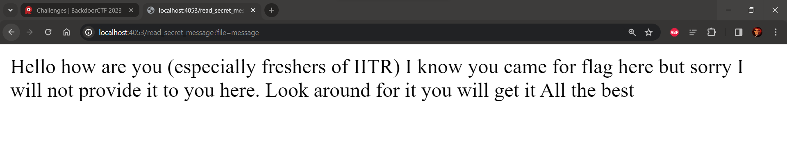

# BackdoorCTF 2023

## Web/Beginner/Secret_of_jackal

## Challenge Overview

Description: I left a message for you. You will love it definitely

Author: j4ck4l :>)



We have been given a [website](http://35.222.114.240:8003). It's a simple lfi challenge


Hmm so to understand the functionality more let's see the source code


```python
def ignore_it(file_param):
    yoooo = file_param.replace('.', '').replace('/', '')
    if yoooo != file_param:
        return "Illegal characters detected in file parameter!"
    return yoooo

def another_useless_function(file_param):
    return urllib.parse.unquote(file_param)

def url_encode_path(file_param):
    return urllib.parse.quote(file_param, safe='')

def useless (file_param):
    file_param1 = ignore_it(file_param)
    file_param2 = another_useless_function(file_param1)
    file_param3 = ignore_it(file_param2)
    file_param4 = another_useless_function(file_param3)
    file_param5 = another_useless_function(file_param4)
    return file_param5
```


## Vulnerability Identification

Okay so let's analyse it block by block.

It's a simple page which include local files. So if you try to read flag file which is one directory back as given in the Dockerfile it will give you a message which says `"Illegal characters detected in file parameter!"`

So if we see the code the `useless()` first sanatise the output using `ignore_it()` function and will remove the `/ & .` characters and then url decodes it using `another_useless_function`


## Exploiting the Vulnerability

If you execute this code locally if you encode the file path 2 times it should give you the flag but it will not run on the server.

Because chrome already decodes the url 1 time and then 2 times it will be done by our code so in total 3 times we have to encode the file path.

So our final payload is `%25252E%25252E%25252Fflag%25252Etxt`

## Obtaining the Flag
So after giving the payload you will get the flag


Flag: **flag{s1mp13_l0c4l_f1l3_1nclus10n_0dg4af52gav}**

Thank You