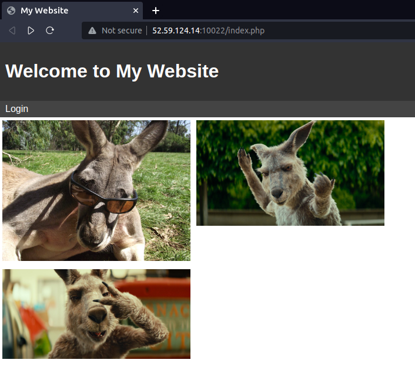
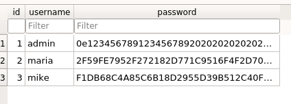
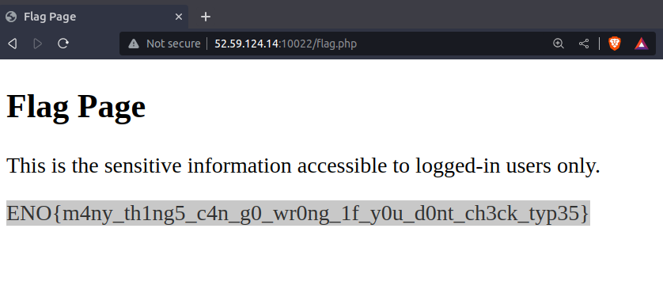

Web\
\-\-\-\-\-\-\-\-\-\-\-\-\-\-\-\-\-\-\-\-\-\-\-\-\-\-\-\-\-\-\-\-\-\-\-\-\-\-\-\-\-\-\-\-\-\-\-\-\-\-\-\-\-\-\-\-\-\-\-\-\-\-\-\-\-\-\-\-\-\-\-\-\-\-\-\-\-\-\-\-\-\-\-\-\-\-\-\-\-\-\-\-\-\-\-\-\-\-\-\-\-\--\
1) TYPicalBoss

\
Description: My boss just implemented his first PHP website. He
mentioned that he managed to calculate a hash that is equal to 0??? I
suppose he is not very experienced in PHP yet. Author: \@moaath

\
{width="14.025cm"
height="15.48cm"}So we have been given this site
<http://52.59.124.14:10022/index.php> . There is a basic login page at
route login.php taking username and password as input.\
When we go to [t](http://52.59.124.14:10022/)he main directory '/' we
can see some files.\
\
\
\
{width="12.243cm"
height="6.562cm"}\
\
\
\
\
\
\
\
\
\
\
\
\
\
The interesting file is databse.db . If we open it with db browser we
can see usernames and the hashed password.

{width="9.67cm"
height="3.254cm"}

So as soon as we see ***'0e'*** in the hashed password we identify it as
a common vulnerability in PHP. So the hashed password will be
interpreted as 0 in php instead of
***'0e12345678912345678920202020202020202020'***

\
So we have to find a string whose SHA-1 hash starts from 0e.\
There is a common technique known as Type-Juggling.\
We can find hashes starting with 0 using this technique.\
<https://github.com/swisskyrepo/PayloadsAllTheThings/blob/master/Type%20Juggling/README.md>\
\
SHA-1 hash of 10932435112 starts with 0e so in PHP it will be
interpreted as 0.\
\
We get the flag after we login with username as admin and password as
10932435112.\
\
**ENO{m4ny_th1ng5_c4n_g0_wr0ng_1f_y0u_d0nt_ch3ck_typ35}\
\
**{width="13.379cm"
height="14.307cm"}**\
\
\
\
\
\
\
\
\
\
\
\
\
\
\
\
\
\
\
\
\
\
\
\
\
\
\
\
**
