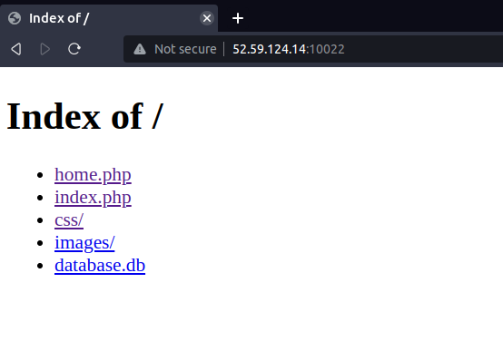
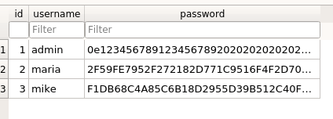
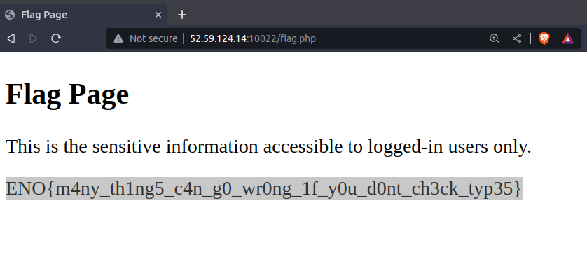

# Nullcon Goa HackIM CTF 2023
# Web
TYPicalBoss

Description: My boss just implemented his first PHP website. He mentioned that he managed to calculate a hash that is equal to 0??? I suppose he is not very experienced in PHP yet.
Author: @moaath

## Challenge Overview

We have been given a website [http://52.59.124.14:10022/index.php](http://52.59.124.14:10022/index.php). The website includes a basic login page at the route `login.php`, which takes username and password as input.

When we access the main directory '/' of the website, we can see some files:

The file that catches our interest is `database.db`. If we open it with a database browser, we can see a list of usernames and their corresponding hashed passwords:

## Vulnerability Identification

As we observe the hashed passwords, we notice that password of admin starts with '0e'. This is a common vulnerability in PHP, where the hashed password is interpreted as 0 instead of the actual hash value '0e12345678912345678920202020202020202020'.

## Exploiting the Vulnerability

To exploit this vulnerability, we need to find a value whose SHA-1 hash starts with '0e'. One common technique for this is known as Type Juggling. More details about this technique can be found [here](https://github.com/swisskyrepo/PayloadsAllTheThings/blob/master/Type%20Juggling/README.md).

For instance, the SHA-1 hash of '10932435112' starts with '0e', so in PHP, it will be interpreted as 0.

## Obtaining the Flag

To retrieve the flag, we need to log in with the username 'admin' and the password '10932435112':

Username: admin
Password: 10932435112

Flag: **ENO{m4ny_th1ng5_c4n_g0_wr0ng_1f_y0u_d0nt_ch3ck_typ35}**

Thank You

